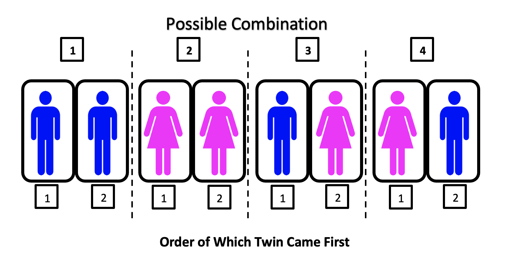
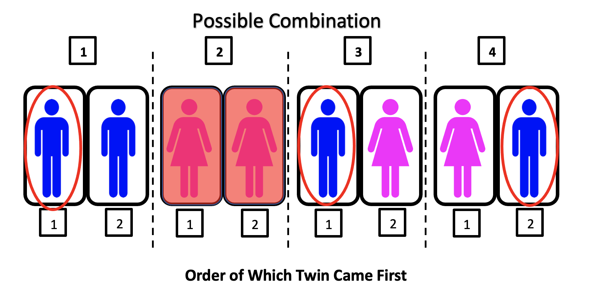
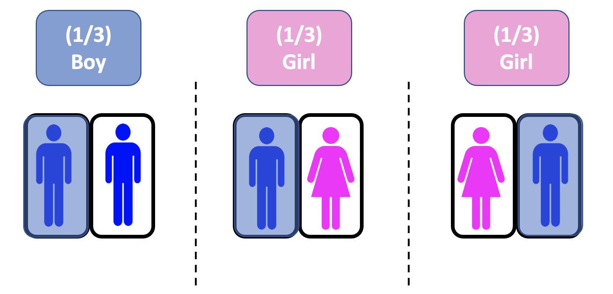
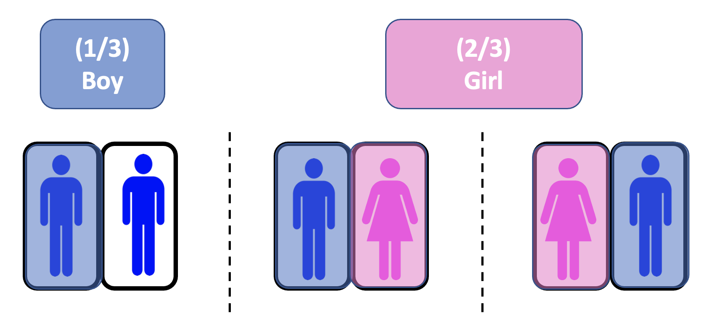

{width=60% height=60%}

# **Background**

It is a beautiful afternoon and you are on your normal walk around the park.  After some time of walking, you decide to sit down and catch a breather.  While on a bench, you start up a conversation with a very nice lady who says she has come to the park with her two twin children.  During the conversation a little boy comes over and calls the lady, "Mom".  As the little boy is talking to his mother, you begin to wonder if the other twin child is also a boy or a girl.  After a few moments of thought, you realize that this question has more to do with probability that with biology.  What is the probability that the other child is a girl or boy?   

# **Probability Explained**

Most people know that there is a fifty-fifty chance of getting tails when flipping coin.  This can be written out as:

$$
\text{------------------------------------------------}
\\\text{Prob(tails) = 1/2} \\\text{------------------------------------------------}
$$

And thanks to our knowledge of biology, this same statement applies.  The probability of have a boy or girl is 50%.  So why then isn't the answer to the 'Twin Problem' just 50% girl and 50% boy?  It is because of possible combinations, which we will go over now. 

If we were to draw out all the combinations of twins, it would look something like the image below.

{width=90%}

In total, there are four possible combinations as drawn out in the image.  In each combination, there is a specific order that is important to note.  We will not use this plot to solve the question.

# **Analysis**

In the story, you find out that one of the woman's twins is a boy.  This will help us eliminate the possible outcome where both children are girls (image below).  The red circle is to demonstrate that we know at least one of the children is a boy for each possible combination.

{width=90%}

Now, something important to note is that we were not told whether the boy was born first.  Because of that, we have to keep both combinations 3 and 4 even though they contain the same pieces in their combos.

The next step will be to start adding some probability to each option.  In the figure below, the remaining combinations are shown with their probability above.  In each option, a male is covered with blue, telling us that we already know there is a male twin.  

{width=90%}

As we see from the illustration above, of the combinations we have left, there is a 1/3 chance of each combination occuring.  At this point, we will combine probabilities of those with the same outcome.

{width=90%}

With the aid of this last visual, we can see that there is a probability of 33% that the other twin is a boy and a 66% that the other twin is a girl.

# **Conclusion**

After a moment of thinking, you turn to the lady on the bench and ask, "I am just guessing here, but is your other child a girl?"  The lady responses with mild surprise, "Yes, have we meet before?"  You reply, "no", and tell her it was just a good guess.

