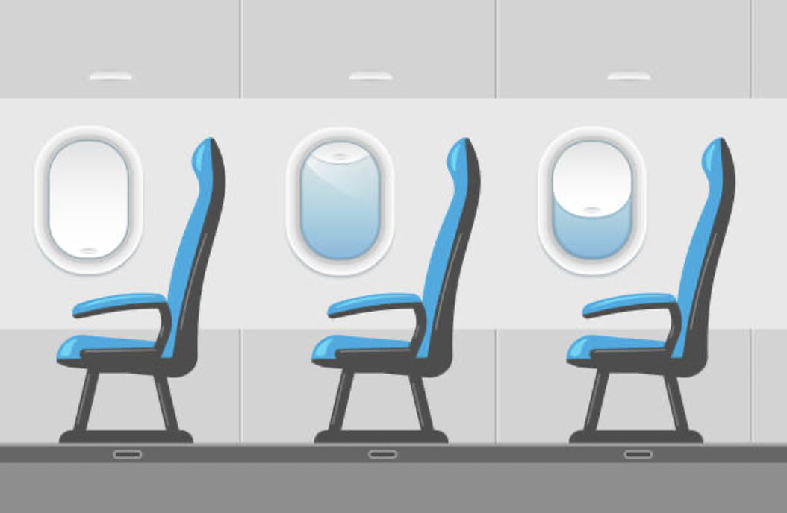
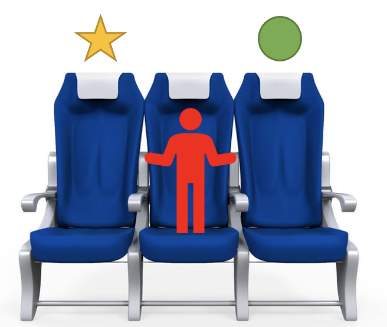
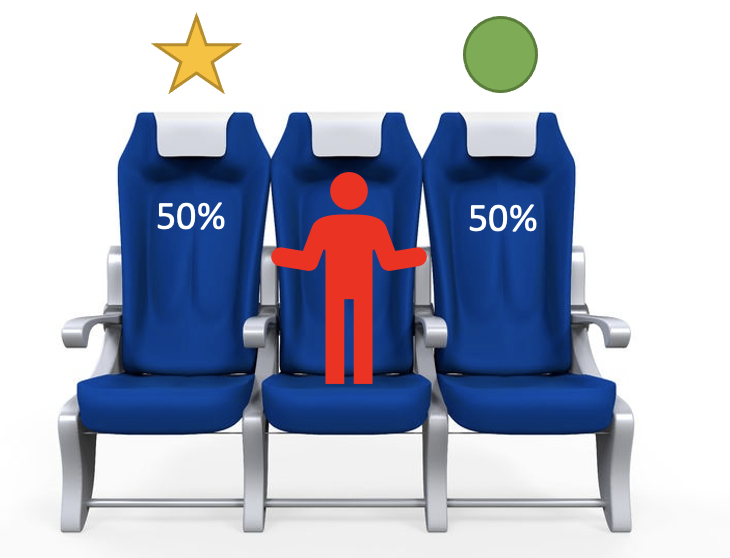

<center>

{width=60% height=60%}

</center>

```{r setup, include=FALSE}
#https://www.youtube.com/watch?v=ZyLVIvBidIA
```

<center>
# **The Problem**
</center>

Today is a special day, you are taking a flight from your hometown to your dream vacation.  As you are about to board to plane, you find out that airline is going to have people board the plane one at a time according to when the bought their ticket.  You look down at your ticket and see that you are number 100 of 100 passengers.  Right before the first person enters the plane to be seated, you hear them tell a boarding agent that they can't remember what seat they purchased.  The boarding agent then whispers to them that they can choose any open seat.  After hearing that conversation, you start to wonder if by the time you get on the plane, if your seat will be taken.  What is the probability that your seat will be taken?

<center>
# **Walk Through Example**
</center>

An good way to understand the answer to this question, will be to first, run through the possible solutions when fewer seats are offered. So, lets try when there are just three passengers.  The first, is the passenger that doesn't know their seat, then a normal passenger, then you.  
For this example, we can use the image below, having the star seat represent your seat and the green dot as where the first passenger's seat is.

<center>
{width=60% height=60%}

</center>

With this example, we will analyze 4 different outcomes.

First, as the first passenger enters the plane, there is a 33% chance, (1/3), that they sit in any seat.  If they were to sit in their seat and every passenger afterwards were to sit in their assigned seat, then there would be a 100% chance that you would sit your seat.

Second, lets say the first person doesn't pick your their seat and instead, picks yours.  That would be mean there is a 0% chance that you will sit in your seat.

For the third outcome, the first passenger is going to sit in the seat that isn't theirs or yours.

<center>
{width=60% height=60%}

</center>

The next person to enter the plane is then given an option, to either sit in your chair, or the first passenger's chair.  This leaves a 50% chance that your seat will be open for when you get on the plane. For this outcome, we will say they choose the first passenger's seat, leaving your seat open.

For the last outcome, we will say that we the second passenger was given a chance between your seat and the first passenger's seat, they chose yours, meaning you were not able to sit in your seat.

<center>
{width=60% height=60%}

</center>

To end this Walk-Through, lets look over the outcomes.  Here below is a table with the Outcome along with whether or not you got your seat.

Outcome 1 | Outcome 2 | Outcome 3 | Outcome 4 
--|---|---|---
Yes | No | Yes | No

Now that we have an idea of what is happening in this story, we can dive into the explanation to see if your guess to the puzzle is correct.

# **Explanation**

For this explanation, I am going to refer to the three tables below.  First thing to know about this puzzle is that the number "100", isn't actually needed to answer this question.  In other words, it is a distraction, meant to make you think on a large scale when really, the answer can be solved form a smaller sample sizes.

Let's start with analyzing the results from **Table 1**.  In this table, there are 2 possibilities; one "No", and one "Yes".  This would mean, of the two possibilities, there is a (1/2) chance that you get your seat.  So let's note, when there are 2 people, there is a 50% chance of getting your seat.

For **Table 2** we are going to follow the same steps as in the paragraph before.  Upon listing out all the possible outcomes and counting up the "Yes/No", we get the result two Yes's and two No's.  This would mean we have a (2/4), or (1/2) chance of getting your seat. Now wait a minute, this is looking familiar, isn't this the same result as with 2 passengers...  Maybe the next Table will give us the final clue to solving this mystery.

After writing the possibilities and adding the results in **Table 3**, we get the results four Yes's and four No's.  This can be written out as (4/8), or simplified to (1/2).  Jinkies! The chance of getting your seat if the first passenger doesn't remember their assigned seat comes out to be 50% again! I think it is time to solve the case.

### Table 1: 2 Passengers

a. First Passenger takes your seat
b. First Passenger sits in their seat

a | b
-|-
No | Yes

### Table 2: 3 Passengers

a. First Passenger Sits in their seat, and so does person 2 
b. First Passenger Sits in you seat 
c. First Passenger Sits in different seat so Person 2 sits in First Passenger's seat.
c. First Passenger Sits in different seat so Person 2 sits in your seat.

a | b | c | d 
--|---|---|---
Yes | No | Yes | No

### Table 3:  4 Passengers

a. First Passenger Sits in their seat, and so does everyone else **(Yes)**

b. First Passenger Sits in you seat **(No)**

c. First Passenger sits in person 2 seat, person 2 sits in person 3 seat, person 3 sits in First Passenger seat **(Yes)**

d. First Passenger sits in person 2 seat, person 2 sits in person 3 seat, person 3 sits in your seat **(No)**

e. First Passenger sits in person 2 seat, person 2 sits in First Passenger Seat, person 3 sits in their seat **(Yes)**

e. First Passenger sits in person 2 seat, person 2 sits in your seat **(No)**

g. First Passenger sits in person 3 seat, person 2 sits in their seat, person 3 sits in First Passenger seat **(Yes)**

h. First Passenger sits in person 3 seat, person 2 sits in their seat, person 3 sits in your seat **(No)**

a   | b  | c  | d  | e  | f | g | h
----|----|----|---- |----|---| --
Yes | No | Yes | No | Yes | No | Yes | No

# **Conclusion**

After walking through the problem and then going through the explanation, we now have the answer to our starting question.  The original question was, "If the first person to enter the plane didn't remember their assigned seat and sat in any random seat, what is the probability that after 99 people get on the plane before you, that your seat will be open"?

To solve this question, we went through 3 examples with 2,3,and 4 passengers.  And from the pattern that we picked up from these examples, we are confident in saying that even if you are the 100th person to enter the plane, there would be 50% chance you would get your seat!  Something important to remember is that this solution only works if each person after the First Passenger will sit in their assigned seat if it is open.  Otherwise, every seat is free game and your chance of getting the seat is not 50%.

Now next time you enter the plane and you hear that one person doesn't know their seat number, you can think to yourself, "there is going to be a 50% chance I get my seat".
