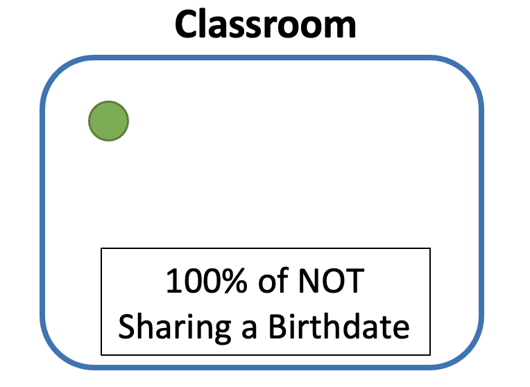
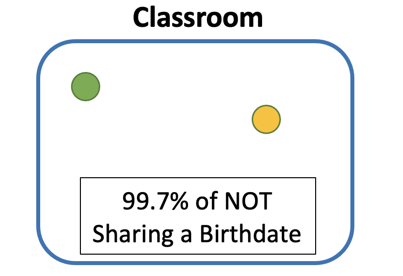

<center>

{width=60% height=85%}
</center>

# **Background**

Remember going to elementary school on your birthday and being so excited?  Today, everyone is going to be part of 'YOUR' special day, what could go wrong?  And then, remember getting to class and finding out that it wasn't just your birthday, but in fact another person's in your class.  Really! Someone else just happens to share the same birthday as you, even with 365 days of the year.  Well, in today's post we are going to uncover the probability of this occuring in any group size.

# **Explanation**

The analysis of this problem will require us to tackle the issue from an opposing view.  Instead focusing on the Probability of Sharing the same date, we are going to begin with the Probability of *Not* Sharing the date.
  The reason we will want/can to do that is because of the following:
  
$$
\text{------------------------------------------------}
\\\text{Prob(Sharing the Same Birthday) = 1 - Prob(NOT Sharing the Same Birthday)} \\\text{------------------------------------------------}
$$

Let's tackle this problem with an experiment by creating a classroom that is going to slowing fill up with students.  As the first students comes into the room, the probability that he doesn't share a  birthday with any one in the room is 100%.  This should make sense cause there is no one else in the room, so of course there is a 100% chance.

<center>

{width=60% height=60%}

</center>

The real trouble will begin as the next student enters the room. Now, we are trying to calculate the chance that the next person WILL NOT have the same birthday; the was to do that will be in two steps.

1. First, take the birthday of student 1 out from our pool of options.  This will leave us with 364 possible ways to NOT share the same day as student 1.  (364/365)

2. Next, multiply the probability of students 2 NOT sharing a birthday with the other students by the probability that student 1 didn't share a birthday with anyone when he was the only one if the classroom.

*A mathematical explanation of the previous steps will be offered later*

$$
\frac{365}{365} *\frac{364}{365} = 99.7\text%
$$

What we learn from the previous step, is that there is 99.7% chance that two people will not share the same birthday.

<center>

{width=60% height=60%}

</center>

From this point, the previous steps are applied for as many number of people are present to calculate the probabiliyt of Not Sharing a Birthday.  In order to find the probability of Sharing the same birthday will require one simple addition.  

Using the classroom example above, let's say that a third student enters the room.  To find out what the probability that two of the three students will share a birthday, the following will be done: 

$$
1- \frac{365}{365} *\frac{364}{365} *\frac{363}{365}= 0.8\text%
$$

<center>

{width=60% height=60%}

</center>

# **Conclusion**

As more students enter the classroom, the probability of sharing a birthday will increase drastically!  For many people, the Birthday Paradox seems very illogical - especially when you find out that with 23 people in a room, there is a 50% chance that two people will share the same birthday.  But once the pattern and explanation is given, the problem seems to make more sense.

```{r, warning=FALSE, message=FALSE}

library(tidyverse)
library(plotly)
library(ggplot2)

x_range = seq(1:71)
inputs = (0:71)

ratio = 0
answer = 0

for (i in inputs) {
  ratio[i + 1] = (365 - i)/365
}

for (i in inputs) {
  answer[i] = prod(ratio[1:i])
}

final = 1 - answer
df = data.frame(x_range, final)


```

```{r, warning=FALSE, message=FALSE}

graph = ggplot(data = df, 
               aes(x = x_range, y = final, group = 1 ,
                   text = paste("Number of People: ", x_range, "\n",
                "Probability: ",round((final * 100),1), "%"))) +
  geom_line(aes(x = x_range, y = final), colour = "blue") + 
  geom_hline(yintercept = .501, linetype = "dashed", color = "red") +
  labs(title = "What are the Chances of a Shared Birthday?",
       y = "Probability",
       x = "Number of People") +
  theme_bw() + 
  scale_y_continuous(labels = scales::percent) +
  theme(plot.title = element_text(hjust = 0.5)) + 
  scale_x_continuous(breaks = scales::breaks_width(10))

ggplotly(graph, tooltip = "text") %>% config(displayModeBar = F)


```


