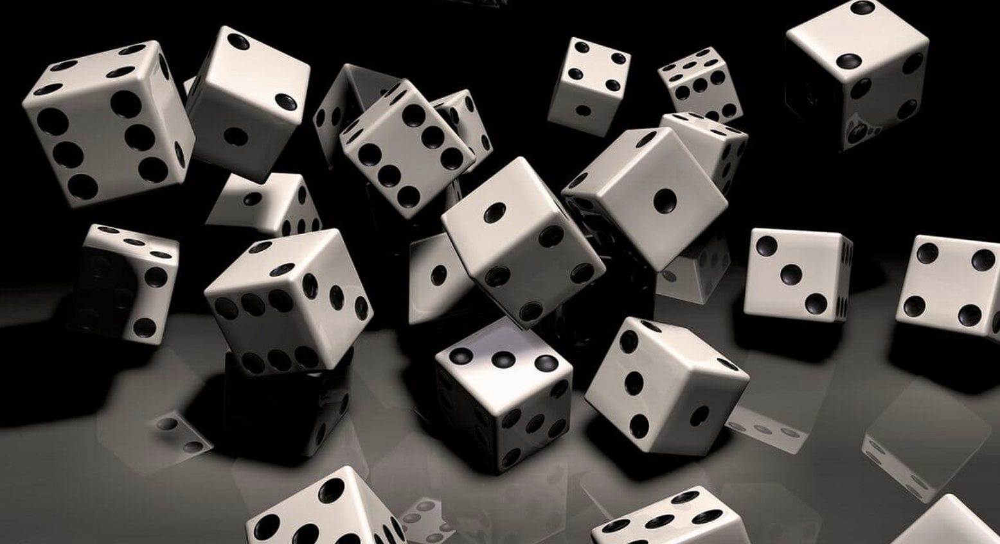
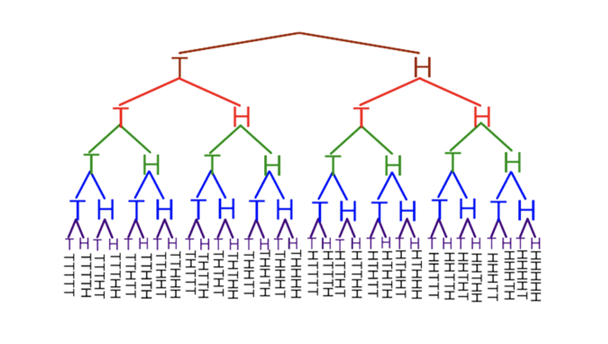

{width=80% height=80%}

# **Welcome to the Land of Probability**

### **Coin Flipping**:

{width=40% height=40%}

You are told to flip a coin 5 times, what is the probability that 2 of the flips result in tails and the others in heads.

Another way we could word this question is, “What is the ratio of all the different combination of 2 tails with 5-coin tosses to all the different coin toss possibilities?”

To begin, let’s solve the later part.  To find all the different coin possible outcomes, we are going to use the following equation:
$$
A^n = \text{Total Possible Outcomes}.
$$
A is the number of options present, and n is the number of layers or rounds repeated.

For example, if we were going to flip a coin 2 times.  We would have 2^2.  Our results would be: 

$$
\text{TT, TH, HT, HH - 4 Total Combinations}
$$
So, for the question we were given, we want to know all the possible combination arrangements for flipping a coin 5 times, this equals

$$
2^5 = 32.
$$

Below is an image to prove the math we have just done.

{width=55% height=55%}

To complete this question, we need to figure out all the different ways we can get 2 tails in 5-coin tosses.  An example would be (THHHT and HHHTT).  In some cases, this can be done in one’s head because there are only 2 or 3 objects.  But with bigger numbers, we will want to understand the formula to help us.

nCr - Combinations - allows us to know all the different combinations possible.  Combinations focus more the combinations of the values/objects, not all the different arrangments of each value.  If our question was based about order, we would use Permutations, (nPr). The equation for combinations is:

$$
\text{Combinations} = \frac{n!}{r!(n-r)!}
$$

To help make sure we understand this principle I have another visual example below.  We will experiment with all the different ways we could arrange 2 X's in a jar of 2 X's and 1 O.

With Combinations, we can see that we are seeing all the different ways we can rearrange the objects.

$$
\text{Combinations}\\
\text{XXO}\\
\text{OXX}\\
\text{XOX}\\
\text{nCr= 3}
$$

Notice how with Permutations (the list below) there are a lot more combinations.  This is because with Permutation, ORDER MATTERS.  We can see that using nPr, we get 6.
$$
\text{Permutations}\\
\text{O}X_1 X_2\\
\text{O}X_2 X_1\\
X_1\text{O}X_2\\
X_2\text{O}X_1\\
X_1 X_2\text{O}\\
X_2 X_1\text{O}\\
\text{nPr= 6}
$$

n is the total number rounds/events/objects, and r is the number of objects. So for our specific example, we would set it up and solve like this:

$$
\text{Combinations} = \frac{5!}{2!(5-2)!} =  \frac{5*4*3*2*1}{2*1*3*2*1} = 10
$$

So that we don't have to solve this by hand, we can use the calulator.
The way we use it is by first, putting the number of coin flips or rounds.  Then we put the nCr followed by the number of Tails/variables that are different from the rest.  This will look like 

5 nCr 2,

 

which gives us the answer 10.

And for understanding, I listed what all the combinations would be:

$$
\text{1. XX000}\\
\text{2. X0X00}\\
\text{3. X00X0}\\
\text{4. X000X}\\
\text{5. 0X00X}\\
\text{6. 00X0X}\\
\text{7. 000XX}\\
\text{8. 0X0X0}\\
\text{9. 0XX00}\\
\text{10. 00XX0}
$$

To complete the question, we will put in our values:10/32 = 5/16 or 0.3125 (31.25%) of getting 2 tails in a 5-coin tosses.

## **Conclusion**
Hopefully you were able to pick up on a lot of concepts that you could see being asked in an interview.   We were able to discuss combinations, permutation, and total combinations.  Hopefully you can remember all these small trick next time you are at a job interview.
-Good Luck!

