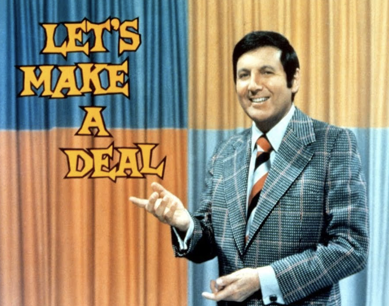
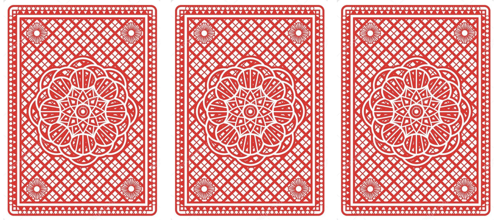
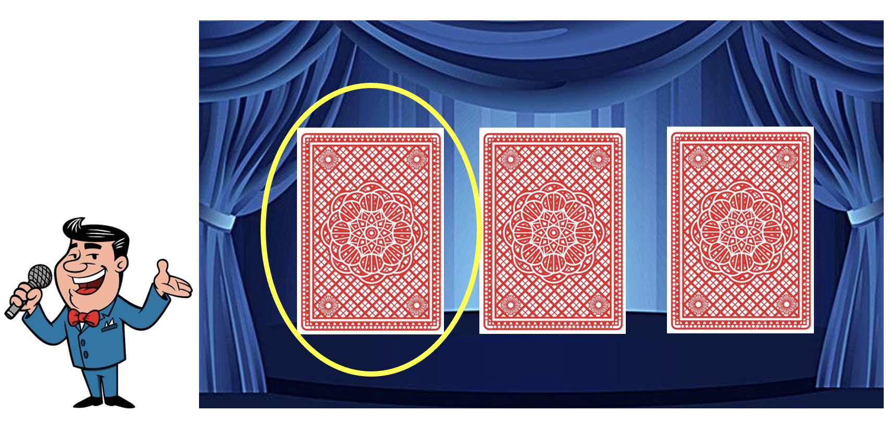
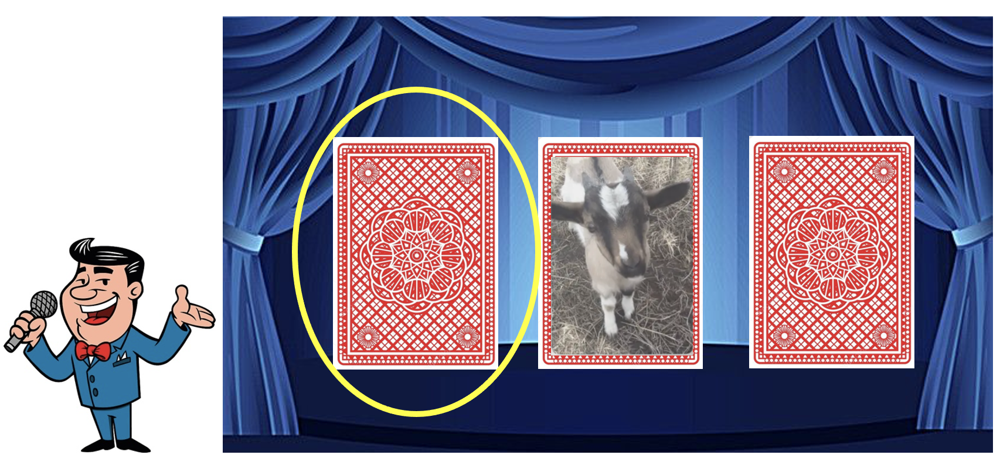
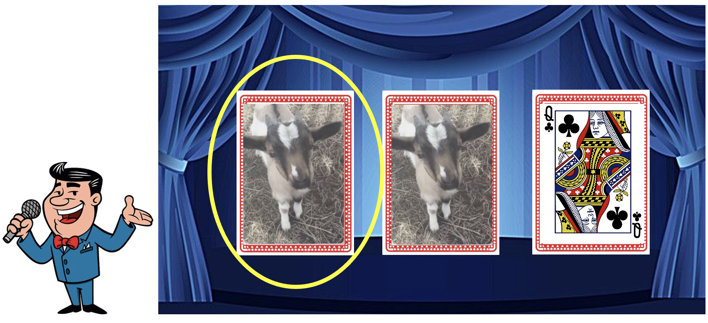
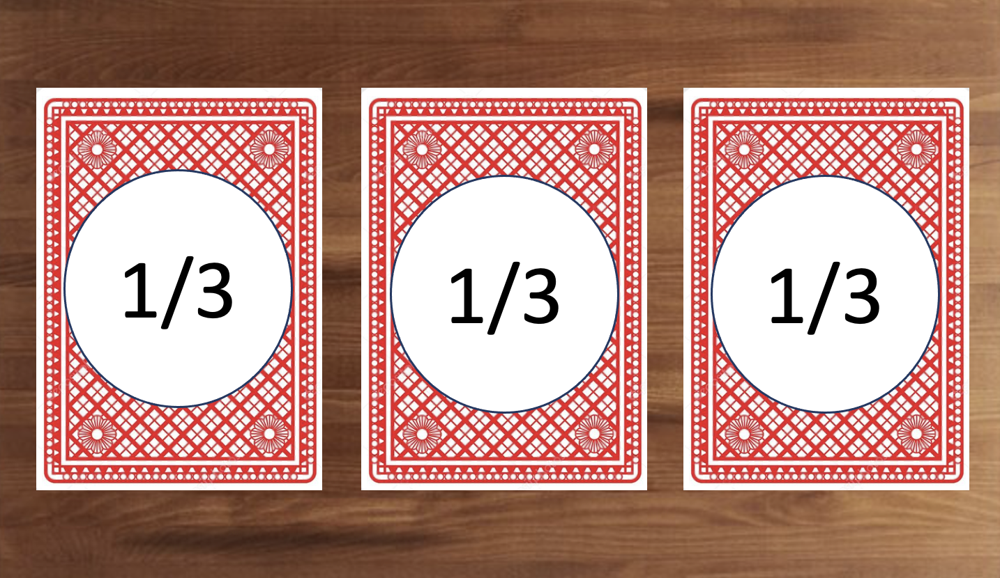
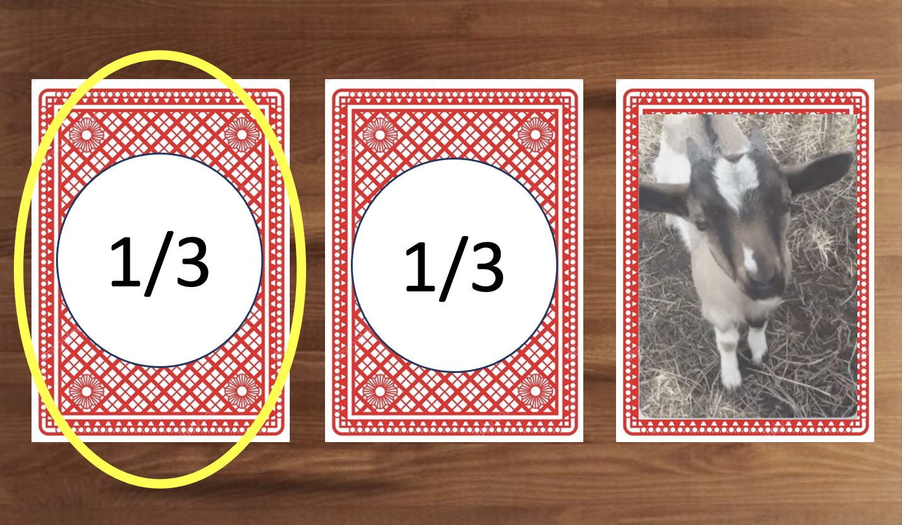
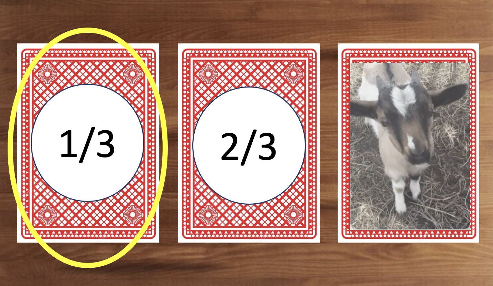

<center>

{width=60% height=60%}

</center>

# **The Game** 

The American TV show, "Let's Make A Deal", started in 1963 and was a global hit.  The premise of the game was that a contestant would be offered a prize and then given a choice whether they would like to keep it, or exchange it for a different prize.  The challenge is that the other prize is hidden from the player.  So in the act of exchanging, the player doesn't know if they are getting a new prize of better or worse value.  

On the show, there was a particular game that was played that has since then become famous and has been named the Monty Hall Problem. In this game, the contestant would be shown three doors, behind one of them, a glorious prize, behind the other two, goats.  Through a serious of steps, the contestant would try and guess which door has the prize.

Before I share some statistical knowledge to them game, lets run through it as if we were contestants.  Instead of playing behind three doors, we will play with playing cards that either have a goat or a queen.  As in the image below, there are there are two possible outcomes, a goat or a queen.

<center>

## **Face Down**

</center>


<center>

{width=55%}

</center>

<center>
## **Face Up**
</center>

<center>
{width=55%}
</center>


# **Let's Play a Round**

What would happen first, is Monty (the Host of the game show), would ask you to pick any door.  You would then pick any of the three cards. **Note, we are not going to flip over this card, instead we will save it till the end.** Now, let's say you pick the left door to save because you think it has the Queen behind it.

<center>
{width=70%}
</center>

After picking which door to save, Monty would then show you a goat behind one of the other two doors.  Since two of the cards have goats on the other side, there will always be at least one card to flip over that has the goat.

<center>
{width=70%}
</center>

At this point, you know that the Queen is either behind the card you chose at the beginning or behind the card still face down.  Monty will then ask you, would you like to keep your card, or switch to the other one.  Which ever card you pick will be the card you end the game with, resulting in either a grand prize, or a goat. 

In this example, you decide to test your luck and stay with the card you picked at the beginning.  Monty then flips over the cards to show that your card had the other goat.  Sadly, you lost the game and didn't get the prize.

<center>
{width=70%}
</center>

The concept of this game seems quite straightforward - pick a card and hope that you picked right.  But, there is little more than just luck at play in this game.  As this game was played more and more times, statisticans found that this game relid greatly upon the fundatmentals of probability.  
In the next section, I will elaborate on how probabilty might hold the key to understand this game as well as winning the prize.


# **The Probability Explained**

To begin, let start off by understanding some simple probability facts.  First, all the probabilities in a given event must add up to 1.  The probabilities of each event may change or moved around but at the end, must always add up to 1.  

Now let's begin; we know that behind two of the cards there are goats and behind the other is the queen.  So, if we were to assign probabilities of being the queen to each card, each would have a 1/3 chance.  At this point, trying to guess which card would be the queen would be a gamble.

<center>
{width=70%}
</center>

Next, Monty is going to flip over one of the cards to show us a goat.  However, we now have an issue with our probabilities, they no longer add up to 1!  Does that mean each card now has a fifty-fifty of being the queen?  

What happens now is what makes this game so interesting.  When we chose that first card, it had a probability of 1/3.  This probability will not change, but rather, the probability of other card.  In order to correct our probability issue, we will have to give it a new probability.  


<center>
{width=70%}
</center>

To figure this out, lets write out what we know.  We know that our card has a 1/3 probability of having the queen.  So to find the probability of the new card, we will subtract 1/3 to 1.  This will give us the probability that the 'Other Card' is the queen.

$$
\text{------------------------------------------------}
\\\text{Prob(Queen| Our Card) = 1/3}\\\text{Prob(Queen| Other Card) = 1 - Prob(Queen| Our Card) = 2/3}\\\text{------------------------------------------------}
$$

<center>
{width=70%}
</center>

This means that my switching cards, we go from a 33% chance of having the Queen, to a 66% chance.

# **Conclusion**

Now wasn't that fun! From this game, we were able to discover the probability secret to raising our chances of Winning the Prize!  To recap what we discovered, when playing this game, when asked if you want to switch your card at the end, SAY YES!

```{r setup, include=FALSE}
library(tidyverse)
library(gganimate)
library(scales)
set.seed(11424)

options = c('g', 'q', 'g')
my_list = list()
n = 400

for (i in seq(1:n)) {
  rand = sample(options)
  my_list[[i]] = rand
}

df = data.frame(my_list)
df = t(df)
df = data.frame(df)
rownames(df) <- 1:nrow(df)

dat = df$X1
dat = data.frame(dat)
row.names(dat) <- NULL
names(dat)[names(dat) == 'dat'] <- 'Door_1'

f_data = dat %>% 
  mutate(Door_2 = case_when(dat == "g" ~ "q",
                           dat =="q" ~ "g"))
```

```{r}

fdat <- f_data %>% 
  mutate(running_total_queens = case_when(Door_2 == "q" ~ TRUE,
                                          Door_2 == "g" ~ FALSE)) %>% 
  mutate(running_total_goats = case_when(Door_2 == "g" ~ TRUE,
                                         Door_2 == "q" ~ FALSE)) %>% 
  mutate(cum_sum_queen = cumsum(running_total_queens)) %>% 
  mutate(cum_sum_goats = cumsum(running_total_goats))
fdat$Round <- 1:nrow(fdat)
```

```{r}
clean = fdat %>% select(c("Round", "cum_sum_queen","cum_sum_goats"))

cdat <- clean %>% 
  mutate(Queen_Percent = round(cum_sum_queen/Round,2)*100) %>% 
  mutate(Goat_Percent = round(cum_sum_goats/Round,2)*100)

```


```{r}

#########
# GRAPH #
#########
library(plotly)


p=(cdat %>% ggplot() + 
  geom_line(data = cdat, aes(x = Round, y = Queen_Percent), color = "red3", size = 1.5) +
  geom_line(data = cdat,aes(x = Round, y = Goat_Percent), color = "grey", size = 1.5) +
  labs(x = "Number of Rounds Played",
       y = "Percent Wins per Round (%)",
       title = "Proof of Winning Strategy") +
  theme_bw() +
  theme(plot.title = element_text(
    hjust = 0.5, face = "bold", size = 20)) +
  theme(axis.text = element_text(face = "bold", size = 10),
        axis.title = element_text(face = "bold", size = 12)) +
scale_x_continuous(breaks = scales::breaks_width(n/5)))+ 
  geom_hline(yintercept= (66.6), linetype="dashed", color = "black")+ 
  geom_hline(yintercept= (33.3), linetype="dashed", color = "black")

ggplotly(p, dynamicTicks = TRUE) %>%
  layout(hovermode = "x") %>% 
  config(displayModeBar = F)


```

```{r}

```


