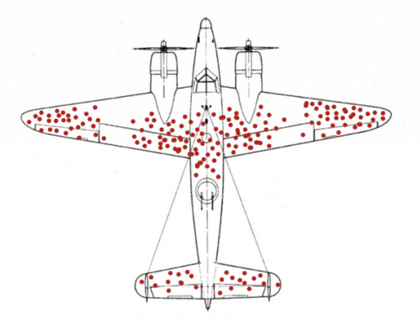
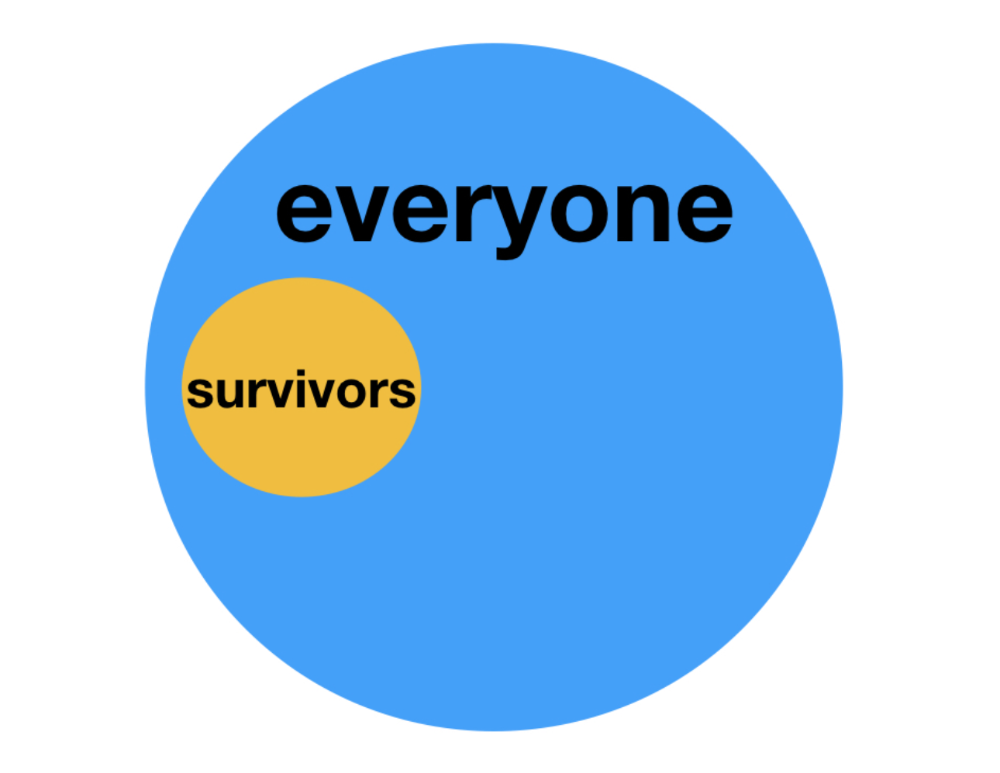
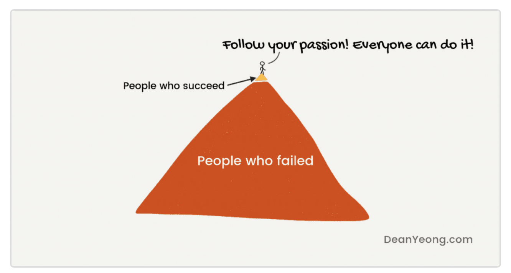

{width=70% height=70%}

# **The Problem**

During World War II, a group of researchers were asked to help the air force provide reason to how they could better protect their planes.  The US military had purposed purchasing Armour that could cover the plane's vital pieces.  They were hoping by doing so, that less planes would get shot down/damaged.  

So, what they did, was they looked at bullet holes/damage on planes that had returned.  An example being the image below. 

{width=60% height=60%}

Based off the image above, what would you do?  What steps would you take to help protect the planes and pilots?

# **Analysis**

Before the military submitted their final decision, leader asked a group of mathematicians, (including famous mathematician Andrew Wald), to look over the project for any extra insights.  

The solution that the mathematicians gave back was quite polar to what was previously presented.  Their solution was: don’t armor the wings and tail.  armor the engine.  Now, if you weren't to have looked at the image, protecting the engine seems like a no-brainer, but according to the image, there are a lot of red dots all over the wings and tail.

The researchers explained that all the images they were studying were of planes that were returning.  None of the images explained what was happening to the planes that were not coming back.  With this knowledge, it can be supposed that the planes that weren't coming back were being hit in the areas where there were not red dots!

The insight and reasoning to this problem later produced what is known today as the **Survivorship Bias**.  Survivorship bias describes the error of looking only at subjects who have reached a certain point without considering the subjects who haven’t.

Thanks to this insight, the military was able to better protect their planes and thus, save lives.

# **Further Application**

The application of **Survivorship Bias** doesn't end with World War II, it is still extremely applicable.  To illustrate what this bias is trying to explain, I will use the following image.

{width=60% height=60%}

The mistake that most commonly takes place is that the data (or people being surveyed) don't represent the whole picture, but rather, a part that doesn't interact well with the rest.

Some great examples from off the web:

 * **Bill Gates**, **Steve Jobs**, and **Mark Zuckerberg** dropped out of college and became wildly successful. But for most college dropouts, it means unemployment and having more immediate student debt.
 
 * **Messi**, **Cristiano Ronaldo**, and **Neymar** are getting paid highly as football players. But the truth is, most players never make it into a game in their lifetime.
 
 * Motivational gurus talk about following your passion and trusting your gut feelings — but there is no shortage of people who followed their passion and ended up seriously wrong.

{width=70% height=70%}

A survivorship bias that I found interesting was about Music and Art.  Music from earlier periods is often thought of as better than music now. This could be because only the best music from the period is played now, while today's music, good and bad, is far more available. So, survivorship of better songs creates the bias in perception.

# **Conclusion**

I hope you were able to enjoy this blog and learn something you can apply in your daily life.  Understanding where your data came from and how it is going to be used can have vital consequences.  

If you are interested in knowing more about the history of **Survivorship Bias**, I would recommend the TEDx below!

https://www.youtube.com/watch?v=NtUCxKsK4xg
