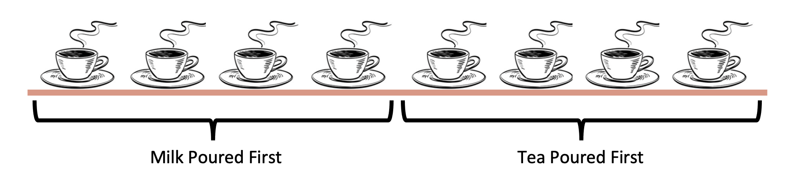

```{r, include=FALSE}
library(tidyverse)
library(pander)

```


<center>

{width=50% height=50%}

</center>

# **Background** 

One of the first fathers' of statistics was named Ronald Fisher.  He is widely known for his research in statistic methods and design of experiments.  In one of his books, he gives a lesson on probability and statistics; which according to some sources, was based on a true event.

On a calm, pleasant day at a cafe, an argument broke out between a lady and a waiter.  The lady was very upset with her order of tea, which consisted only of milk and tea.  Now, little history about tea, during this time period it was common practice to pour tea first and then milk. Well, our customer lady was upset because she claimed that the tea that given was made in the wrong order - (milk then tea).

Fisher, the statistician, goes on to explain ideas on how we could test whether or not this lady's accusation is correct.  In his proposed test, he said to offer the lady 8 cups of tea, 4 of them being milk then tea, and the other 4, tea then milk.  She would be told that 4 of them were prepared in the "proper" way and that her task was to correctly label them.  With all of this in mind, we can dive into the analysis of what is happening.

# **Analysis**

To start off this experiment, we need set up our hypotheses.  In general, a hypothesis is a statement about a possible outcome that is predicted to occur. We start with a null and alternative hypothesis. The null hypothesis states what is generally believed/accepted; while the alternative states a possible outcome that differs from the already accepted.  So for this experiment:

$$
H_0 (null):\text{Lady can not distingish the two different types}\\  
H_a (alternative): \text{Lady can distingish the two different types}
$$

<center>


{width=80% height=80%}


</center>

The next factor we get to decide is at what point are we comfortable with saying, "this Lady can indeed, taste the difference between the two types".  In statistics, we call this alpha.  And for this experiment and in common statistic practice, we are going to set alpha equal to 0.05.

$$
\alpha = 0.05\\
$$

Now that we have established our hypotheses and alpha, we can now begin our experiment.  To find answers to our experiment, we are going to perform an Exact Binomial Test.  This test does well in counting the number of success compared to the number of failures.  In this experiment, we have 8 total cups with 2 groups of different tea preparation styles.  For each cup, she has 2 choices, giving her a 50% chance of being correct. 

Using r-studio, we are going to use the binomial test to find out what the p-values would be based on how many cups she could identify correctly.  

The following sections tell us what the p-values would be for each test.

<center>
# **Tests**
</center>

<center>
## **6 Cups Correct**
</center>

To calculate the p-values of getting 6 cups corrects, we are going to do the following:

$$
\text{P(X} > 6| H_0 = \text{true)}\
\text{= P(X = 6| p = 0.5)}
$$
```{r, include=FALSE}
#+ P(X = 7| p = 0.5) + P(X = 8| p = 0.5)}
```


The following graph helps us visualize what that this math looks like.  It is done by drawing out a Binomial Distribution and then highlighting the areas we are interesting in solving.  The equation to this math is:

$$
P(X=x) = \binom{8}{x}  p^x(1-p)^{8-x}
$$

Our actual value is listed below.

```{r, warning=FALSE}
pp = (plot(0:8, dbinom(0:8, 8, 0.5), type = 'h',
     lwd = 9,col = c(rep(1,6), 
                     rep(2)), 
     main = "Binomial Probability",
     ylab = "P(X = x)", xlab = "Number of successes"))
```

The p-value for 6 successes is:

```{r, include=FALSE}
pander(sum(dbinom(7,8,0.5)))
```

Now, at the beginning of this test, we decided we wanted an alpha of 0.05.
Well, 0.1094 > 0.05, which means if the lady was only able to identify 6 of the cups correctly, we would fail to reject the null hypothesis, meaning we do not believe she can taste the difference.

<center>
## **7 Cups Correct**
</center>

$$
\text{P(X} > 7| H_0 = \text{true)}\
\text{= P(X = 7| p = 0.5)}
$$

```{r, warning=FALSE}
plot(0:8, dbinom(0:8, 8, 0.5), type = 'h',
     lwd = 9,col = c(rep(1,7), rep(2)),
     main = "Binomial Probability",
     ylab = "P(X = x)", xlab = "Number of successes")
```

The p-value for 7 Cups Correct is 0.03125, and 0.03125 < 0.05.  This means that if she were to successfully identify 7 of the 8 cups correctly, we would have sufficient evidence to suggest that she can indeed taste the difference between Tea Types.

```{r, include=FALSE}
sum(dbinom(7,8,0.5)) %>% pander()
```

<center>
## **8 Cups Correct**
</center>

$$
\text{P(X} > 8| H_0 = \text{true)}\
\text{= P(X = 8| p = 0.5)}
$$

```{r, warning=FALSE}
plot(0:8, dbinom(0:8, 8, 0.5), type = 'h',
     lwd = 9,col = c(rep(1,8),
                     rep(2,3)),
    main = "Binomial Probability",
     ylab = "P(X = x)", xlab = "Number of successes")
```

And lastly, we have if she were to identify all 8 cups correctly, her value would be 0.003906, which is < 0.05.  With this value, we can say we evidence to suggest that the lady can indeed taste the difference between the two types of tea.

```{r, include=FALSE}
sum(dbinom(8,8,0.5)) %>% pander()
```

<center>
## **All Options**
</center>

For this last graph, I went ahead and gave the p-value that we would get for each given number of successes.  It might be worth discussing the p-values for the successes 1 and 0.  They both have p-values less than 0.05, but if she were to only get 1 cup correct, we wouldn't be say that she is good at identifying types.  It is important to think through the problem with the gathered information before making any accusations.

```{r}

data.frame(heads = 0:8, 
           pmf = dbinom(x = 0:8, size = 8, prob = 0.5)) %>%
ggplot(aes(x = factor(heads), y = pmf, fill = factor(pmf))) +
  geom_col() +
  geom_text(
    aes(label = round(pmf, 3), y = pmf + 0.01),
    position = position_dodge(0.9),
    size = 3,
    vjust = 0
  ) +
  labs(title = "Probability of X = x successes.",
       x = "Successes (x)",
       y = "Probability") +
  theme_bw() + 
  theme(legend.position = "none") + scale_fill_brewer(palette = "Dark1") +
  theme(plot.title = element_text(
    hjust = 0.5, face = "bold", size = 20))
```

<center>
## **Conclusion**
</center>
In today's blog, we were able to use Probability and Statistics to answers to this 'real world' question.  Now, most of our questions aren't going to be based on tea and milk, but Bionomial Distributions are being used constantly.  Where ever there is a question that broken down into Yes/No, True/False, or Success/Failure, this is the distribution you would want to use.  

