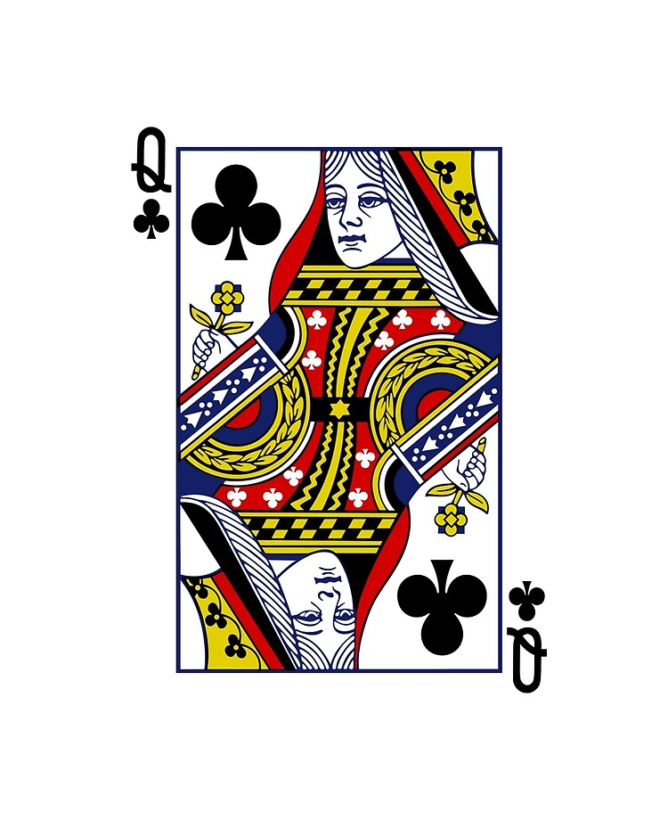

```{r setup, include=FALSE}
knitr::opts_chunk$set(echo = FALSE)

# Learn more about creating blogs with Distill at:
# https://rstudio.github.io/distill/blog.html

#https://ellwood12.github.io/data_science_blog/

#https://en.wikipedia.org/wiki/Potato_paradox

#https://www.analyticsvidhya.com/blog/2016/07/20-challenging-job-interview-puzzles-which-every-analyst-solve-atleast/

```

```{r,warning=FALSE, message=FALSE}
library(jpeg)
library(png)

queen_url <- "https://github.com/Ellwood12/data_science_blog/raw/master/images/Queen.jpg"
z <- tempfile()
download.file(queen_url,z,mode = "wb")
pic_q <- readJPEG(z)
writeJPEG(pic_q,"Queen.jpg")

goat_url <- "https://github.com/Ellwood12/data_science_blog/raw/master/images/Goat.png"
x <- tempfile()
download.file(goat_url ,x,mode = "wb")
pic_g <- readPNG(x)
writePNG(pic_g,"Goat.png")

Card_url <- "https://github.com/Ellwood12/data_science_blog/raw/master/images/Back_side.png"
y <- tempfile()
download.file(Card_url,y,mode = "wb")
pic_c <- readPNG(y)
writePNG(pic_c,"Card.png")

```





